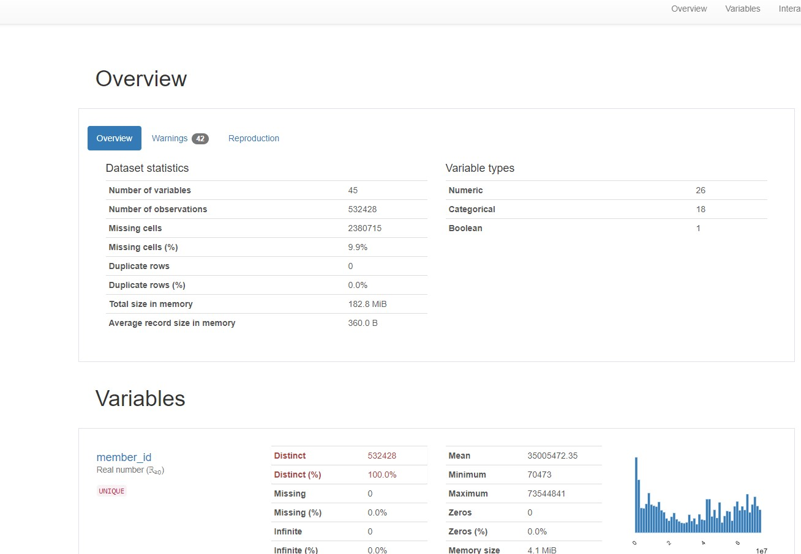

# ML-Task

This is a jupyter notebook created through cola. 
I used the data directly from my google drive for training and testing.

I also created a pandas profiling html page.
The overview page is very large in size. Attached the same in the mail with the link to this repository.

In the notebook you can find 

* EDA performed on the training dataset.
* Missing Value Analysis
* Feature Engineering and Selection 
* Fitting the ML algorithms on training dataset for predictions.
* Analysing the best algo for prediction.
* Preparing the test data for prediction on the selected model to get predictions.

### Used outlier analysis but did not incorporate while prediction since the columns with outliers can have a varying range of data.

